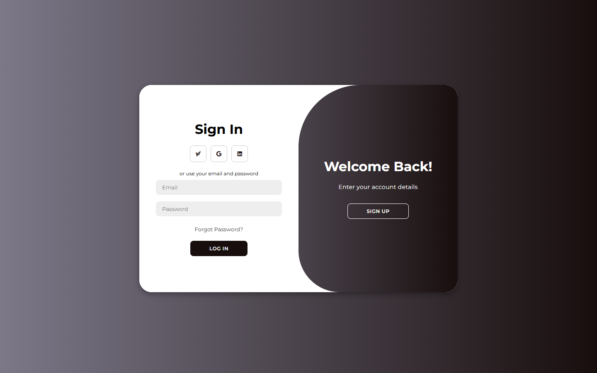
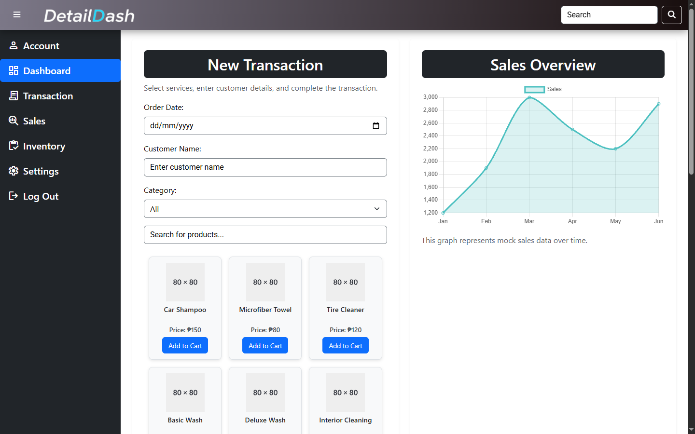
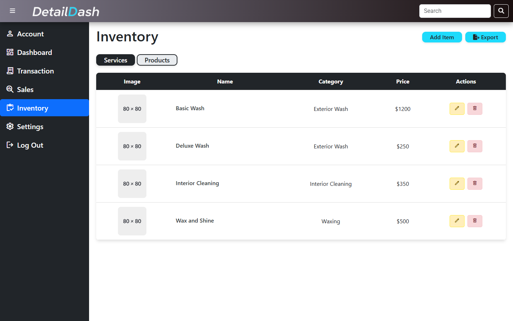
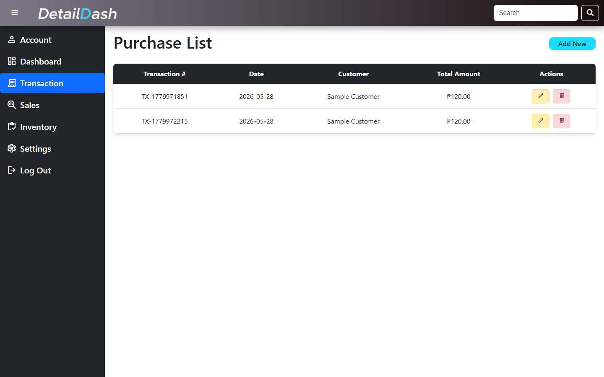

# DetailDash

DetailDash is a Flask-based point-of-sale prototype for a car wash business. It was built as a school project to practice web application routing, database-backed CRUD operations, authentication flow, inventory management, and transaction handling.

## Features

- Account registration and login
- Dashboard view with transaction and inventory sections
- Product and service inventory CRUD
- Transaction recording with customer, date, cart items, payment, and total amount
- SQLite database initialization with sample services and products
- Flask API endpoints consumed by the JavaScript frontend

## Screenshots

### Sign In



### Dashboard



### Inventory



### Transactions



## Tech Stack

- Python
- Flask
- Flask-SQLAlchemy
- SQLite
- HTML
- CSS
- JavaScript
- Bootstrap

## Public Portfolio Notes

This public-ready copy was reconstructed from the strongest project branch for portfolio review. Generated files, local SQLite databases, Python cache files, and duplicate legacy frontend files were removed. Passwords are stored with Werkzeug password hashes in this version.

The screenshots above were captured from the local Flask app after a browser QA pass. This remains a school-project prototype, so the public framing should emphasize implemented routing, authentication, CRUD, and transaction workflows rather than production POS readiness.

## Project Structure

```text
detaildash/
  backend/
    app.py
    db.py
    requirements.txt
    static/
    templates/
  docs/
    screenshots/
  instance/
    database.db
```

The `instance/database.db` file is generated locally when the app starts and is ignored by Git.

## Run Locally

From the project root:

```powershell
cd backend
python -m venv .venv
.\.venv\Scripts\Activate.ps1
pip install -r requirements.txt
$env:SECRET_KEY="change-this-for-local-use"
python app.py
```

Open `http://localhost:5000`.

Create a new account through the registration form, then sign in.

## Verification

The current public copy was checked with `pip-audit` installed in the active virtual environment:

```powershell
python -m compileall -q backend
python -m pip_audit -r backend\requirements.txt
```

Additional smoke checks passed for:

- `GET /`, `/index`, `/inventory`, `/transaction`
- `GET /api/products`, `/api/services`, `/api/transactions`
- Browser QA with `agent-browser` for sign-in, account, dashboard, inventory, and transaction pages

## Key Routes

- `GET /` and `GET /login` - login and registration page
- `POST /register` - create account
- `POST /login` - sign in
- `GET /index` - dashboard
- `GET /inventory` - inventory management
- `GET /transaction` - transaction page
- `GET /api/products` - product list
- `GET /api/services` - service list
- `GET /api/transactions` - transaction list

## Resume Framing

Built a Flask and SQLite point-of-sale web application for a car wash business, implementing authentication, inventory CRUD, service/product APIs, and transaction recording.
